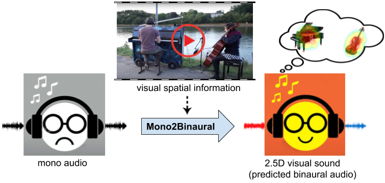

## 2.5D Visual Sound
[[Project Page]](http://vision.cs.utexas.edu/projects/2.5D_visual_sound/)    [[arXiv]](https://arxiv.org/abs/1812.04204) [[Video]](https://www.youtube.com/watch?v=Wrx3pv_ixdI) [[Dataset]](https://github.com/facebookresearch/FAIR-Play)<br/>



<br/>

[2.5D Visual Sound](https://arxiv.org/abs/1812.04204)  
 [Ruohan Gao](https://www.cs.utexas.edu/~rhgao/)<sup>1</sup> and [Kristen Grauman](http://www.cs.utexas.edu/~grauman/)<sup>2</sup> <br/>
 <sup>1</sup>UT Austin, <sup>2</sup>Facebook AI Research  
 In Conference on Computer Vision and Pattern Recognition (**CVPR**), 2019  
 
<br/>

If you find our code or project useful in your research, please cite:

        @inproceedings{gao2019visualsound,
          title={2.5D Visual Sound},
          author={Gao, Ruohan and Grauman, Kristen},
          booktitle={CVPR},
          year={2019}
        }

### FAIR-Play Dataset
The [FAIR-Play](https://github.com/facebookresearch/FAIR-Play) repository contains the dataset we collected and used in our paper. It contains 1,871 video clips and their corresponding binaural audio clips recorded in a music room. The code provided can be used to train mon2binaural models on this dataset.

### Training and Testing
(The code has beed tested under the following system environment: Ubuntu 16.04.6 LTS, CUDA 9.0, Python 2.7.15, PyTorch 1.0.0)
1. Download the FAIR-Play dataset and prepare the hdf5 splits files accordingly by adding the correct root prefix.

2. [OPTIONAL] Preprocess the audio files using reEncodeAudio.py to accelerate the training process.

3. Use the following command to train the mono2binaural model:
```
python train.py --hdf5FolderPath /YOUR_CODE_PATH/2.5d_visual_sound/hdf5/ --name mono2binaural --model audioVisual --checkpoints_dir /YOUR_CHECKPOINT_PATH/ --save_epoch_freq 50 --display_freq 10 --save_latest_freq 100 --batchSize 256 --learning_rate_decrease_itr 10 --niter 1000 --lr_visual 0.0001 --lr_audio 0.001 --nThreads 32 --gpu_ids 0,1,2,3,4,5,6,7 --validation_on --validation_freq 100 --validation_batches 50 --tensorboard True |& tee -a mono2binaural.log
```

4. Use the following command to test your trained mono2binaural model:
```
python demo.py --input_audio_path /BINAURAL_AUDIO_PATH --video_frame_path /VIDEO_FRAME_PATH --weights_visual /VISUAL_MODEL_PATH --weights_audio /AUDIO_MODEL_PATH --output_dir_root /YOUT_OUTPUT_DIR/ --input_audio_length 10 --hop_size 0.05
```

### Acknowlegements
Portions of the code are adapted from the CycleGAN implementation (https://github.com/junyanz/CycleGAN) and the Sound-of-Pixels implementation (https://github.com/hangzhaomit/Sound-of-Pixels). Please also refer to the original License of these projects.


### Licence
The code for 2.5D Visual Sound is CC BY 4.0 licensed, as found in the LICENSE file.
